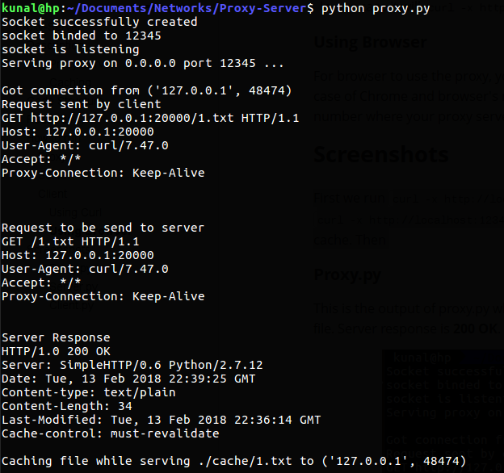
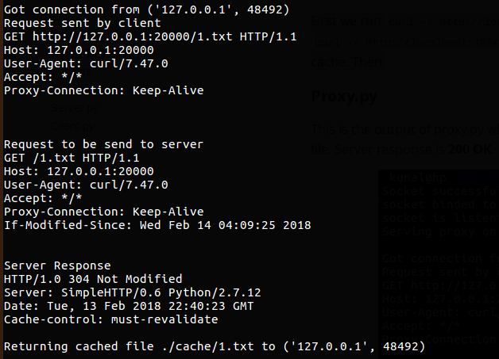
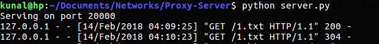
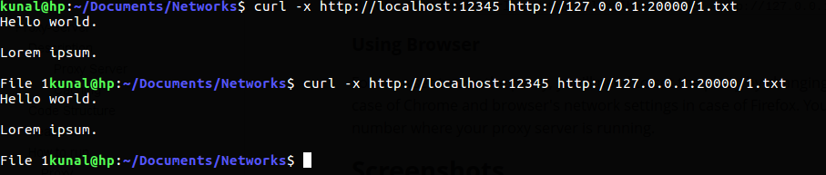
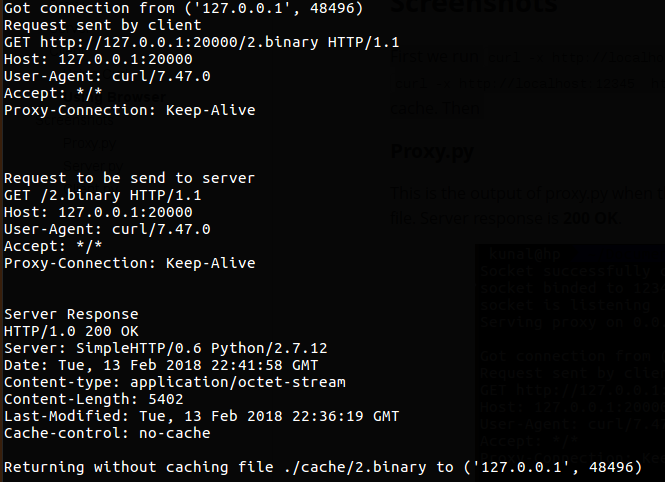
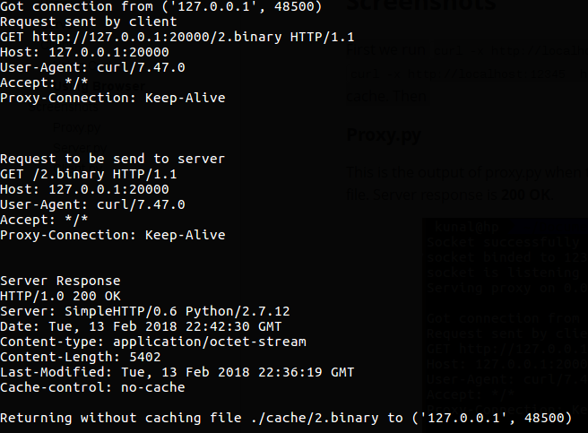
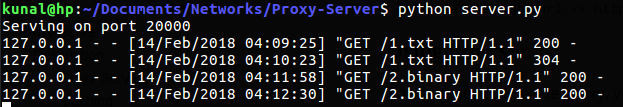

# Proxy-Server
An HTTP proxy server implemented via python socket programming with caching, threading and blacklisting.

## Description

#### **Proxy Server**

Generally, when the client (browser or curl command) makes a request, the request is sent to the web server. The web server then processes the request and sends back a response message to the requesting client.

In order to improve the performance we create  a proxy server between the client and the web server . A web proxy is a program that acts as an intermediary between a web client (browser or curl) and a web server.

The client requests the objects via the **proxy server**. The proxy server will forward the client’s request to the web server. The web server will then generate a response message and deliver it to the proxy server, which in turn sends it to the client.

#### **Caching**

When the proxy server gets a request, it checks if the requested object is **cached** (i.e. server already has the request webpage or file), and if yes, it returns the object from the cache, without contacting the server.

If the object is not cached, the proxy retrieves the object from the server, returns it to you and caches a copy of this webpage for future requests if the **Cache-Control** header is set to **must-revalidate**. If the **Cache-Control** header is set to **no-cache**, then the proxy server does not caches the webpage. 

In case of any further requests if the webpagepr file is already cached then, the proxy utilize the **If Modified Since** header to check if any  updates have been made, and if not, then serve the response from the cache, otherwise webpage or file is again retrieves from the server.

## Code Structure

- [proxy.py](/proxy.py) is the main proxy file.

- [server.py](/server.py) contains the code of backend server.

- [blacklist.txt](/blacklist.txt) contains list of blacklisted servers.

- [cache](/cache) folder will be contains the files cached by proxy server.

## Features

- All HTTP requests cannot be cached, and is dependant on the Cache-Control header.
- Checks if the cached object has been modified ? If yes, forwards the request to server and also updates the cache.
- Threaded proxy server thus able to handle many requests at the same time.
- Cache has limited size, so if the cache is full and proxy wants to store another response then it removes the least recently asked cached response.
- Certain servers (their ports) are blacklisted so that  users can't access it.

## How to run

### Proxy

- Default port

  `python proxy.py` runs proxy server on port 12345.

- Specify proxy port while running proxy

  `python proxy.py 60000 ` runs proxy server on port 60000.

### Server
- Run server from [server.py](server.py) file using `python server.py`

### Client

Client can request the webpage or a file from above running server through either browser or curl.

#### **Using Curl**

`curl -x http://host_addr:host_port http://server_addr:server_port/object_location`

  In our case it will `curl -x http://localhost:12345  http://127.0.0.1:20000/1.txt`.

#### **Using Browser** 

For browser to use the proxy, you'll need to set the proxy by changing in your system's network settings in case of Chrome and browser's network settings in case of Firefox. You need to give the host and the port number where your proxy server is running.

## Screenshots

### Case 1: When HTTP Request can be cached

First we run `curl -x http://localhost:12345  http://127.0.0.1:20000/1.txt` once then again we run `curl -x http://localhost:12345  http://127.0.0.1:20000/1.txt` to see what happens when file is in cache. The outputs are as follows: 

#### Proxy.py

This is the output of proxy.py when the file was not cached, so it send request to server and cached the file because **Cache-Control** is set to **must-revalidate**. Server response is **200 OK**.

This is the output when another user requests the same file from the server and the file is cached by proxy server. The proxy server adds **If-Modified-Since** in the header when it sends request to the server. The server sees the header and checks if file has been modified or not?. In this case it was not modified so it sent **304 Not Modified** in the response. In case it was modified, server would have sent the new file.

#### Server.py

We can see for server both request were get, but one contained **If-Modified-Since** header so server sent **304 Not Modified** response message, and in other case it send **200 OK**

#### Client.py

For clients both GET requests have the same response. The once difference it speed with it can download file. When the cached file was accessed the speed would be faster than the speed with which file was accessed first time. 

### Case 2: When HTTP Request is cannot be cached 

First we run `curl -x http://localhost:12345  http://127.0.0.1:20000/2.binary` once then again we run `curl -x http://localhost:12345  http://127.0.0.1:20000/2.binary` to see what happens when file cannot be cached by proxy server. The outputs are as follows:

#### Proxy.py

This is the output of proxy.py when the file was not cached, so it send request to server and but it cannot cache the file because **Cache-Control** is set to **no-cache**. Server response is **200 OK**.

This is the output when another user requests the same file from the server and as the file is not cached by proxy server the request will proceed same as the first request and server's response is **200 OK**.

#### Server.py

We can see for server both requests for `2.binary` both are responded using **200 OK** as the file cannot be cached by the proxy-server but for the 1st request for `1.txt` was responded using **200 OK** and second as responded using **304 Not Modified** as the file was cached and not modified.

#### Client.py

For clients both GET requests have the same response. The will be no difference in speed as proxy-server has to get the file from the server, everytime client requests the file.